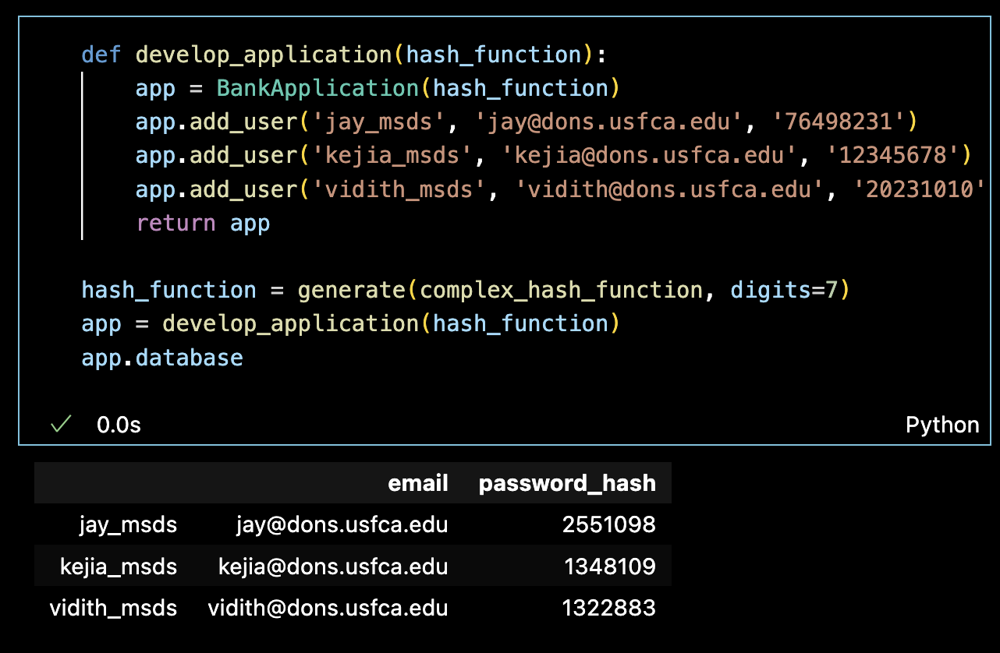
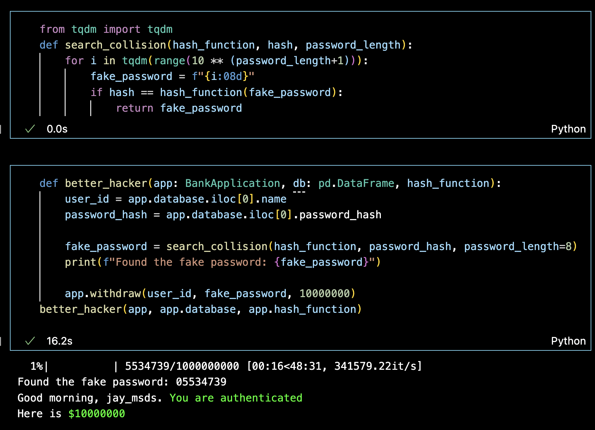
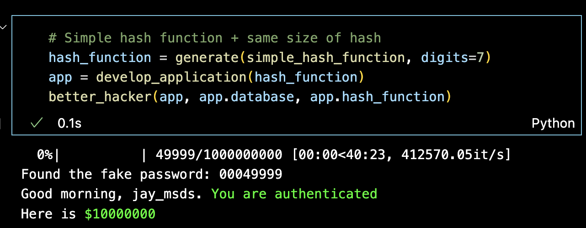

## **Hash Functions & Cybersecurity: A Deep Dive**

### **1. Hash Function Basics**
The core of hash function is that it converts input of any size into a fixed-size value, commonly known as a hash code. The prime length of hash tables minimizes collisions and ensures an even distribution of values. 

---
### **2. Data Collision & The Birthday attack**
The "Birthday Paradox" shows that as the set of randomly chosen values (like birthdays) grows, also does the probability of a collision.
**Hash Collision**: When two disparate inputs yield the same hash value. As input volumes burgeon, the odds of encountering two different inputs with identical hash values amplify.
**Birthday Attack**: an exploitation of the Birthday Paradox in the realm of cryptography. Hash collision allows them, for instance, to fake a document's signature.

---

### **3. Code Demo: A Practical Look into Hash Function Collisions(main.ipynb)**

In our Jupyter notebook demo, we've taken a dive into the real-world implications of hash functions in security:
1. **The Bank App Scenario**: We initialize a bank application where users, like Jay, Kejia, and Vidith, each have unique IDs and passwords. The bank doesn't store actual passwords but rather their hashes.

2. **The Hacker's Strategy**: Through exploiting hash function collisions, a sophisticated hacker can ascertain a "fake" password that produces the same hash as the real one. In our demo, it took a feasible trial for the hacker to identify such a password.

3. **Hash Function Distribution**: The efficacy of hash functions hinges on their ability to evenly distribute values. A simple hash function, more prone to collisions, compromises security. Our demo highlights this vulnerability, showing that with a non-evenly-distributed hash function, a hacker can identify a fake password almost instantly.

---

**Repository Contents**:  
📦 Project  
┣ 📜 bank_application.py  
┣ 📜 color.py 
┣ 📜 hash_functions.py  
┣ 📜 README.md  
┗ 📜 main.ipynb  

---